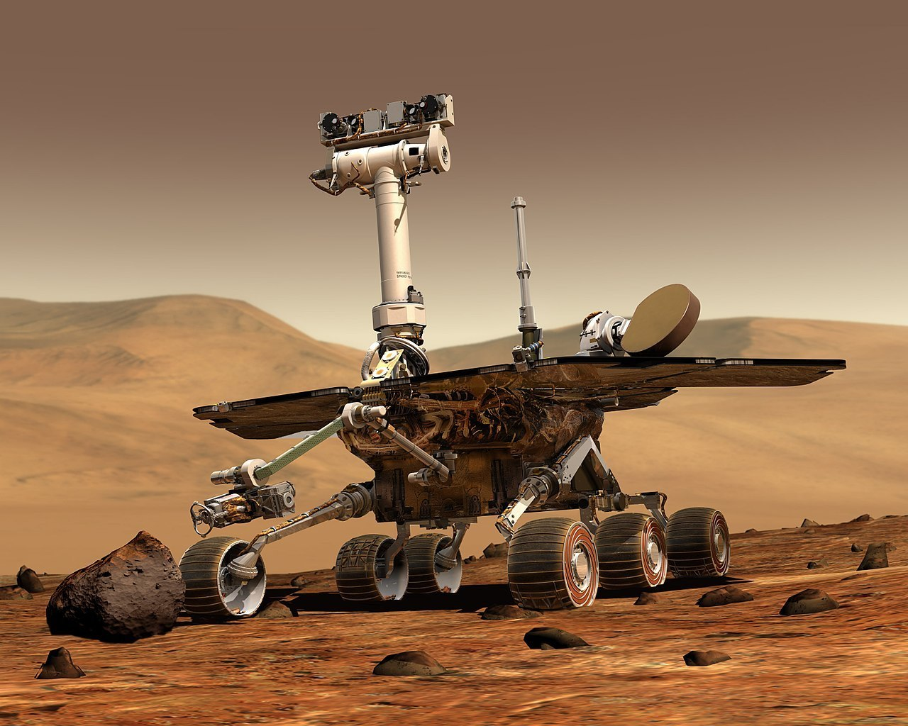

# Kata: Mars exploration Rover



- **Objective**: Develop an API for remote-controlled vehicles on Mars.

- **Initialization**: The rover starts with a position (x,y) and a direction (N,S,E,W).

- **Commands**: The rover receives strings of commands like 'FFLR'.

  - F: Move forward.
  - L: Turn left.
  - R: Turn right.

- **Output**: Final location of the vehicle. Example: '2:3:W'.

## Rules and Examples

- Examples for a rover initialized at coordinates 0,0 and oriented towards the north:

  - 'L' => '0:0:W'
  - 'R' => '0:0:E'
  - 'F' => '0:1:N'
  - 'RFF' => '2:0:E'
  - 'LFF' => '0:8:W'
  - 'LLFF' => '0:8:S'
  - 'FRFFR' => '2:1:S'

To install dependencies:

```bash
bun install
```

To run:

```bash
bun run src/index.ts your-command # A valid command would be: FRFFR
```

This project was created using `bun init` in bun v1.1.3. [Bun](https://bun.sh) is a fast all-in-one JavaScript runtime.
